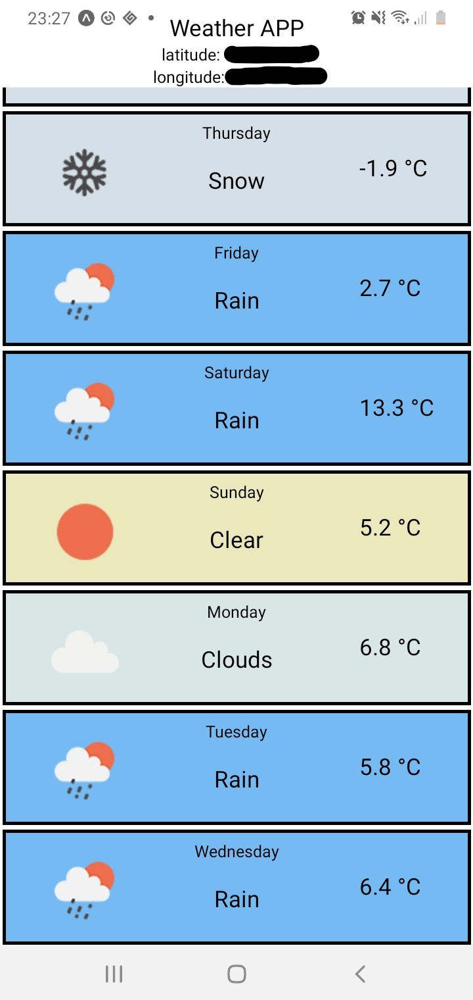

# React Native Weather Forecast App
----------------------------------------

###### Description

The project uses React Native to create a weather forecast app, this app requires location permissions  
calls the API from openweathermap.org, and displays the forecast for the next 7 days changing the style based on weather.

----------------------------------------

###### Installation & Run Guide

• Requires NodeJS

• Clone Repository

• Run command ( npm install ) in the repository directory to install node_modules

• run command ( npm start )

----------------------------------------

-----------------------------------------

###### Operations

• App will request location permissions

• App will display forecast